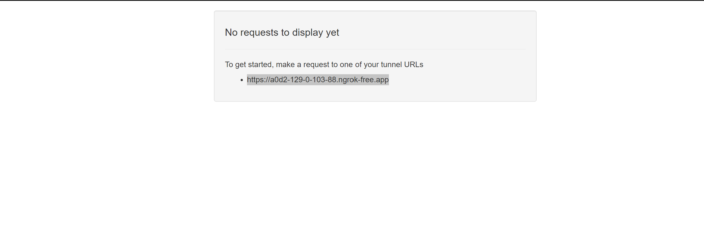
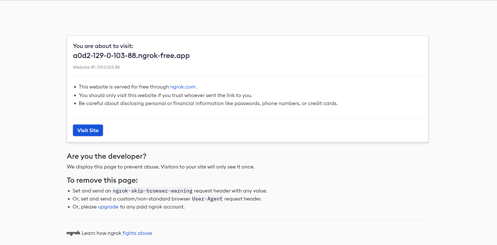
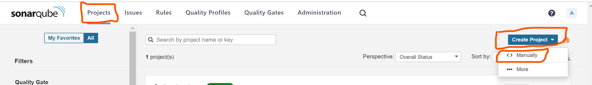
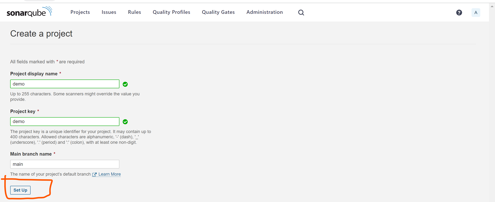
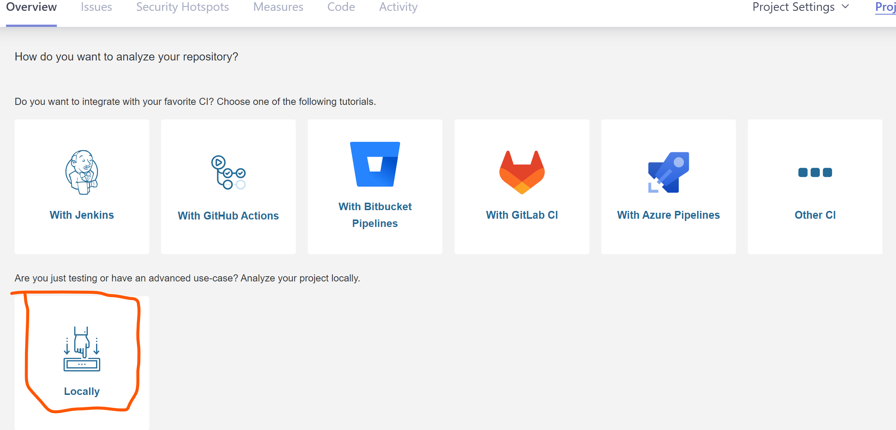
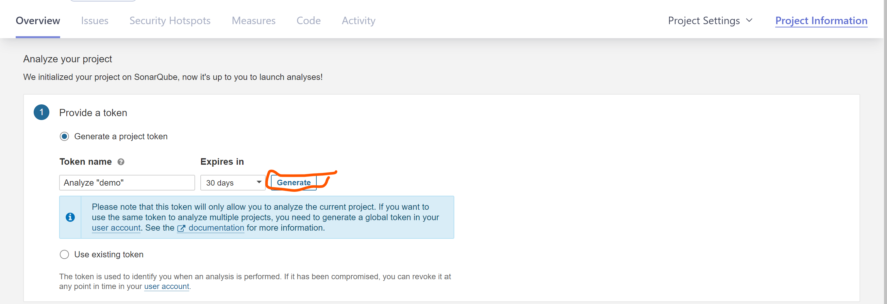
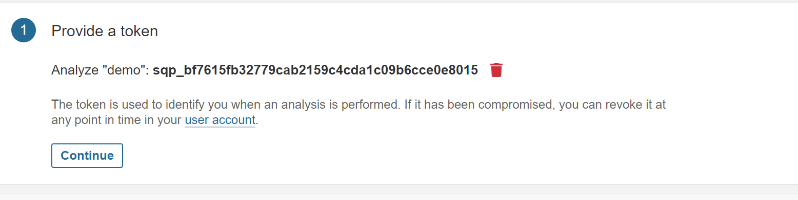
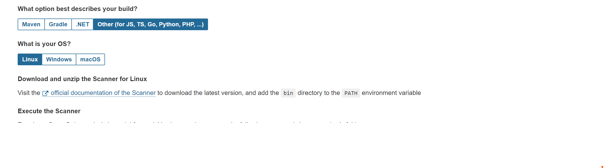
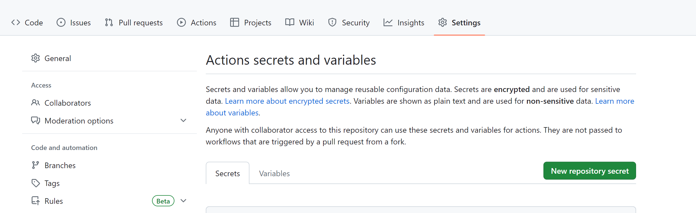
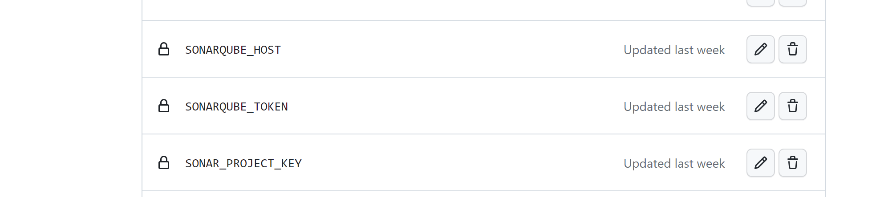

###  This Guide provides Quick and Easy Steps to Deploy Sonarqube on Docker And Integrate it with GitHub

#### **Step 1: Deploy SonarQube**

- Deploy SonarQube with the following command;

```bash
docker run -d \
    -p 9000:9000 \
    -v sonarqube_extensions:/opt/sonarqube/extensions \
    --name sonaqube-server \
     sonarqube:community
```

- You can read on [SonarQube](https://docs.sonarqube.org/9.6/setup-and-upgrade/install-the-server) documentation for other deployment alternatives.

#### **Step 2: Create Ngrok account**

- `Ngrok` is a simplified API-first ingress-as-a-service that adds connectivity, security, and observability to your apps in one line. You can sign-up [here](https://ngrok.com/).

- You can create an `Ngrok` account with already existed `GitHub` account. 

#### **Step 3: Expose Sonarqube With Ngrok**

`Ngrok` exposes with a via a unique url that overides use of `localhost:9000`. This `localhost:9000` may not resolve to sonarqube server/application causing the pipeline to fail. `Ngrok` creates a `hostname/domain name` that maps to `localhost:9000`

- Once `Ngrok` account is created, navigate to Dashboard.

- Click on the  drop-down botton infront of `Getting Started` then `Your AuthToken`.
- Copy your `Authtoken`.
- Deploy `Ngrok` that to expose sonarqube with this command;

```bash
docker run -d -p 4040:4040 --name ngrok  -e NGROK_AUTHTOKEN=<You Authtoken here> ngrok/ngrok:latest http host.docker.internal:9000
```

#### NB

> `SonarQube` instance deployed earlier on is exposed externally on port `9000`. `Ngrok` will route internal http traffic to port `9000`

- You can find details of `Ngrok` configuration [here](https://ngrok.com/docs/using-ngrok-with/docker/).

#### **Step 4: Access Sonarqube via Ngrok**

- On your favorite browser lunch `localhost:4040`. you should see something like this.

- Once open, click on `visit site` and this will redirect traffic to `sonarqube` server on `localhost:9000` with `url` similar to `https://a0d2-129-0-103-88.ngrok-free.app`.


#### **Step 5: Create Project On Sonarqube**

- login to `SonarQube` server on the browser. 
- Click on `Project` and then `Create Project`

- Select `<> Manual Creation`
- Enter Project name and Click on `Set Up`

- Click on `Locally`

- Set an expiration date for your token. 
 > You can equally click on `Use existing token` if you have created and configured one
- Click `Generate` once set.

- You should see something like this

- Click on `Continue`


- Click on `Others` and select `Linux` as your `OS`.

> This portion of configuration depends on what you want to check or scan on your code. 

You should have something like this
```bash
sonar-scanner \
  -Dsonar.projectKey=demo \
  -Dsonar.sources=. \
  -Dsonar.host.url=https://a0d2-129-0-103-88.ngrok-free.app \
  -Dsonar.token=sqp_bf7615fb32779cab2159c4cda1c09b6cce0e8015
```

#### **Step 6: Integrate SonarQube with GitHub**

 - On your project/project select **Settings > Secrets and Variables > Actions**
 
 - Click on **New repository and secret** 
 - Set `SONARQUBE_HOST=https://a0d2-129-0-103-88.ngrok-free.app`
 - Set `SONARQUBE_TOKEN=token generated on step 5`
 - (Optional). Set `SONAR_PROJECT_KEY=demo`
 